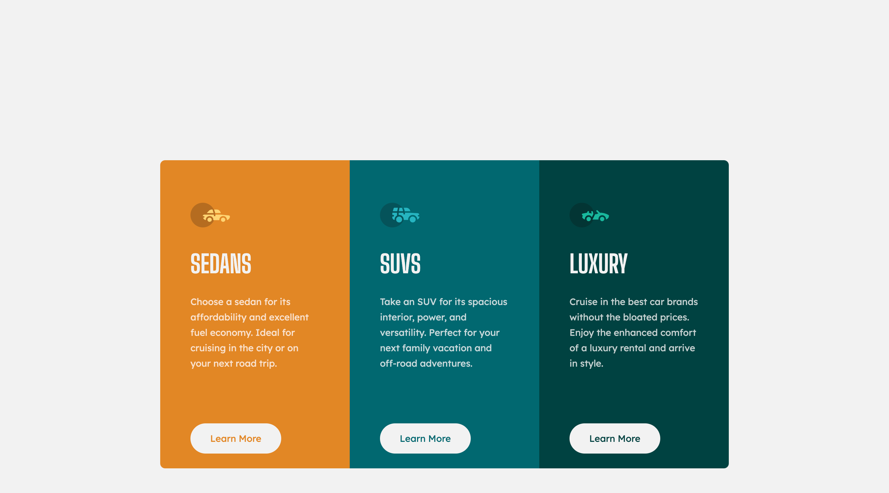

# Frontend Mentor - 3-column preview card component solution

This is a solution to the [3-column preview card component challenge on Frontend Mentor](https://www.frontendmentor.io/challenges/3column-preview-card-component-pH92eAR2-). Frontend Mentor challenges help you improve your coding skills by building realistic projects.

## Table of contents

- [Overview](#overview)
  - [The challenge](#the-challenge)
  - [Screenshot](#screenshot)
  - [Links](#links)
- [My process](#my-process)
  - [Built with](#built-with)
  - [What I learned](#what-i-learned)
  - [Continued development](#continued-development)
  - [Useful resources](#useful-resources)
- [Author](#author)

## Overview

### The challenge

Users should be able to:

- View the optimal layout depending on their device's screen size
- See hover states for interactive elements

### Screenshot

### Links

- Solution URL: [GitHub repository](https://github.com/justinconnell/fem-3-column-preview-card-component)
- Live Site URL: [Live site](https://justinconnell.github.io/fem-3-column-preview-card-component/)

## My process

### Built with

- Semantic HTML5 markup
- CSS custom properties
- Flexbox
- CSS Grid
- Mobile-first workflow

### What I learned

I exported the design from figma and used it as a background to get the elements positioned correctly. instead of thinking top-down about positioning I took the opposite approach and layed out elements using a bottom-up approach.

### Continued development

I signed up for [Frontend Masters](https://frontendmasters.com) and am following the CSS learning path. I will be completing all the CSS challenges before moving on to JS where I plan to use vanilla JS for the challenges then move on to React, Next and Vue with Nuxt - at which time I plan to employ a CSS framework like Tailwind.

### Useful resources

- [Frontend Masters](https://frontendmasters.com) - following the CSS learning path has helped me get a grip on the basics of CSS.

## Author

- GitHub - [Justin](https://github.com/justinconnell)
- Frontend Mentor - [@justinconnell](https://www.frontendmentor.io/profile/justinconnell)
- Twitter - [@justin2code](https://twitter.com/justin2code)
